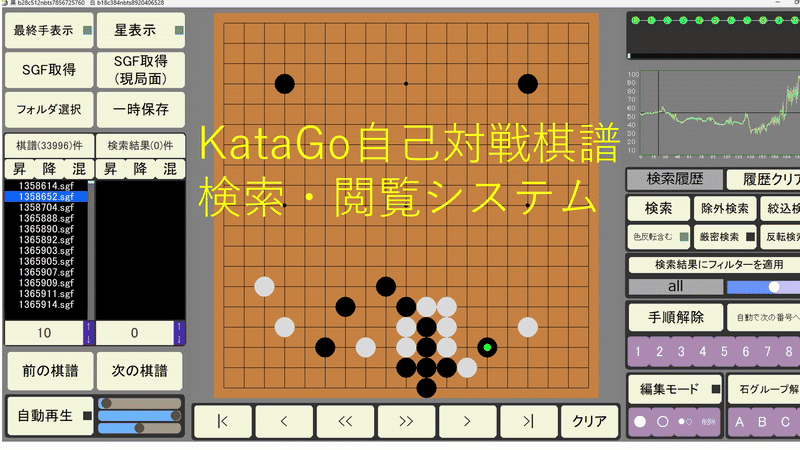

# 🎮 KataGo棋譜検索システム

HSP3で開発されたKataGo-rating-gamesの棋譜閲覧ツール。KataGoの自己対戦棋譜の棋譜を検索、閲覧できます。

ダウンロードはこちらから→[KataGo棋譜検索システム](https://github.com/sphosino/katago-kifu-search/releases)

[操作方法](https://sphosino.github.io/katago-kifu-search/readme.html)

[](LICENSE)
[](https://hsp.tv/)


<sub>※開発中の画面です</sub>

## 🍎️ 機能一覧
- 棋譜の自動再生（一手ごとの時間を複数のパラメータで調整）
- 局面検索
- 棋譜出力（SGF、ファイル）
- Katago公式サイトから最新棋譜取得
  
---
## 🚀 開発クイックスタート

### 🛠 必要条件
- HSP3.6以上

### インストール
```bash
## セットアップ手順

1. リポジトリをクローンします：（別フォルダに分ける）

git clone https://github.com/sphosino/katago-kifu-search.git
git clone https://github.com/sphosino/hsp_common.git

2. 以下のように同じ階層に配置してください。　
root/
   ├── katago-kifu-search/
   └── hsp_common/

3.hsp_commonの中にあるgenerate_headers.hsp を一度実行してください。
    これでall_includeというファイルがhsp_common内の各フォルダ内に生成されます。

4.katago-kifu-searchフォルダを開く。
  config_path.hsp を開いてDIRNAME ="C:...."という行を編集してください。リリース用のフォルダになります。
  フォルダの構成は以下のようにしてください。
  root/
  ├── sub/
  │   ├── auto_download.exe
  │   └── sub.exe
  ├── title/
  │   └── ;起動画面用画像フォルダ、ランダムで表示される
  ├── 棋譜/
  │   └── ;katagoの棋譜リストが入っている
  └── save/
      └── ; 一時的に棋譜を保存するフォルダ

5. search_process.hsp, sub.hspをexe化して、subフォルダにいれたあと、main.hspが実行できるようになればOKです

```


hsp_commonのリポジトリは[こちら](https://github.com/sphosino/hsp_common)

## License
This project is licensed under the MIT License. See the [LICENSE](./LICENSE) file for details.
---
開発の進捗や技術メモは[開発日誌](https://sphosino.github.io/katago-kifu-search)にまとめています。
