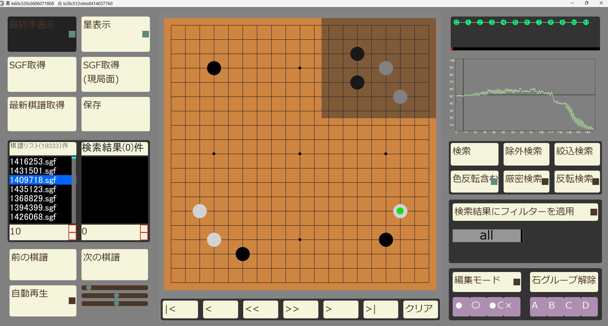

# 🎮 katago-kifu-search - KataGo棋譜分析ツール

HSP3で開発されたKataGo棋譜解析ツール。大量の棋譜から特定の局面を高速検索します。

[](LICENSE)
[](https://hsp.tv/)


（注）開発中の画面です

## 🚀 クイックスタート

### 必要条件
- HSP3.6以上
- Git
- KataGo解析環境（別途セットアップが必要）

### インストール
```bash
# 1. リポジトリクローン & サブモジュール取得
git clone --recurse-submodules https://github.com/sphosino/katago-kifu-search.git
cd katago-kifu-search

# 2. 設定ファイル生成（初回のみ）
hsp3 main.hsp -setup

## 📂 ディレクトリ構造
```plaintext
root/
├── hsp_common/     ← 共通ライブラリ（別リポジトリ）
│   ├── basic_module1.hsp
│   ├── basic_module2.hsp
│   └── basic_module3.hsp
└── katago-kifu-search/
    ├── main.hsp
    └── modules/
        ├── p1_module1.hsp
        └── p1_module2.hsp

1.セットアップ方法
git clone https://github.com/sphosino/katago-kifu-search.git
cd katago-kifu-search

hsp_commonが必須：本プロジェクト単体では動作しません

開発ガイド

# サブモジュール更新
  git submodule update --remote

# 全依存関係の状態確認
  git status
  git submodule status


[開発日誌](https://sphosino.github.io/katago-kifu-search)

***
囲碁AI、KataGoのサイト
https://katagotraining.org/

KataGoを動かす検討ソフトを導入する場合、BadukMegapackがおすすめ。僕も利用させてもらってます！  
https://github.com/wonsiks/BadukMegapack


***
囲碁AI、KataGoのサイト
https://katagotraining.org/

KataGoを動かす検討ソフトを導入する場合、BadukMegapackがおすすめ。僕も利用させてもらってます！  
https://github.com/wonsiks/BadukMegapack
