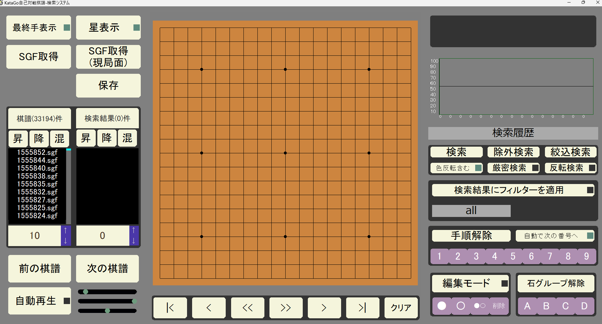

# 🎮 KataGo棋譜検索システム

HSP3で開発されたKataGo-rating-gamesの棋譜閲覧ツール。KataGoの自己対戦棋譜の棋譜を検索、閲覧できます。

ダウンロードはこちらから→[https://github.com/sphosino/katago-kifu-search/releases]

[](LICENSE)
[](https://hsp.tv/)


<sub>※開発中の画面です</sub>

## 🍎️ 機能一覧
- 棋譜の自動再生（一手ごとの時間を複数のパラメータで調整）
- パターンによる複雑な局面検索
- 棋譜出力（SGF、ファイル）
  
---
## 🚀 クイックスタート

### 🛠 必要条件
- HSP3.6以上

### インストール
```bash
## セットアップ手順

1. リポジトリをクローンします：（別フォルダに分ける）

git clone https://github.com/sphosino/katago-kifu-search.git
git clone https://github.com/sphosino/hsp_common.git

2. 以下のように同じ階層に配置してください。　
root/
   ├── katago-kifu-search/
   └── common/

これでkatago-kifu-searchの各ファイルがhsp_commonを参照できます。
```

## 📂 開発時のおすすめディレクトリ構成(例）
```plaintext
root/
├── common/     ← 共通ライブラリ（別リポジトリ、下にリンクあります）
│   ├── basic_module1.hsp
│   ├── basic_module2.hsp
│   └── basic_module3.hsp
└── katago-kifu-search/　←このリポジトリ
│    ├── main.hsp
│    └── modules/
│       ├── p1_module1.hsp
│       └── p1_module2.hsp
│
└──その他プロジェクトのリポジトリ
```
hsp_commonのリポジトリは[こちら](https://github.com/sphosino/hsp_common)

---
開発の進捗や技術メモは[開発日誌](https://sphosino.github.io/katago-kifu-search)にまとめています。
